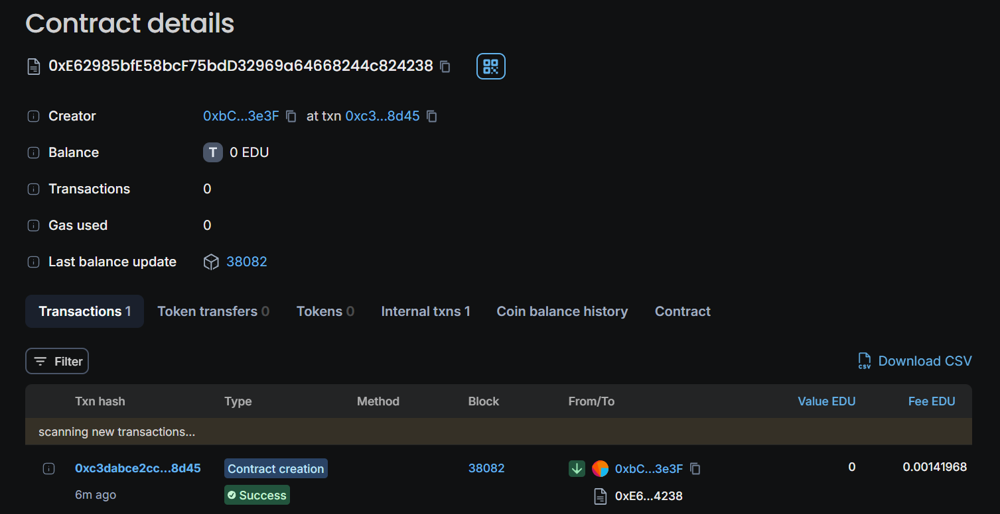

# Rise-in-submission
# QuizContract Smart Contract

## Overview

The QuizContract smart contract allows users to create and manage a quiz with a series of questions. Key functionalities include:

- **Adding Questions:** Create new quiz questions.
- **Activating/Deactivating Questions:** Control which questions are available for answering.
- **Answering Questions:** Submit answers to active questions and receive rewards for correct answers.
- **Managing Funds:** Deposit and withdraw funds to/from the contract.
- **Retrieving Data:** Get details of questions and the total number of questions.

## Features

### 1. **Question Management**

- **Add Question**
  - Function: `addQuestion(uint questionId, string memory questionText, string memory answerText, uint rewardAmount)`
  - Description: Adds a new question to the quiz with its answer and reward amount.
  - Access: Only the contract owner can add questions.

- **Activate Question**
  - Function: `activateQuestion(uint questionId)`
  - Description: Makes a question active, allowing users to submit answers.
  - Access: Only the contract owner can activate questions.

- **Deactivate Question**
  - Function: `deactivateQuestion(uint questionId)`
  - Description: Disables a question, making it unavailable for answering.
  - Access: Only the contract owner can deactivate questions.

- **Answer Question**
  - Function: `answerQuestion(uint questionId, string memory answerText)`
  - Description: Submits an answer to an active question. Requires a fee of 0.05 ether. Correct answers receive a reward.
  - Access: Any user can answer questions.

### 2. **Fund Management**

- **Add Funds**
  - Function: `addFunds()`
  - Description: Allows users to deposit ether into the contract.
  - Access: Any user can deposit funds.

- **Withdraw Funds**
  - Function: `withdrawFunds(uint amount)`
  - Description: Allows users to withdraw ether from the contract.
  - Access: Any user can withdraw funds from their balance.

### 3. **Retrieving Information**

- **Get Question**
  - Function: `getQuestion(uint questionId)`
  - Description: Retrieves the text and activation status of a question by its ID.
  - Returns: The question text and its active status.

- **Get Total Questions**
  - Function: `getTotalQuestions()`
  - Description: Returns the total number of questions in the quiz.

## Usage

1. **Deploy the Contract:** Deploy the `QuizContract` to the Ethereum blockchain.
2. **Add Questions:** Use the `addQuestion` function to add quiz questions.
3. **Activate/Deactivate Questions:** Manage question availability using `activateQuestion` and `deactivateQuestion`.
4. **Participate in the Quiz:** Users can answer questions by calling the `answerQuestion` function and paying the required fee.
5. **Manage Funds:** Deposit funds using `addFunds` and withdraw using `withdrawFunds`.
6. **Retrieve Data:** Use `getQuestion` to view specific questions and `getTotalQuestions` to get the count of all questions.

## Events

The contract emits the following events:

- `QuestionAdded(uint questionId, string questionText)`: Emitted when a new question is added.
- `QuestionActivated(uint questionId)`: Emitted when a question is activated.
- `QuestionDeactivated(uint questionId)`: Emitted when a question is deactivated.
- `QuestionAnswered(uint questionId, address participant, bool isCorrect)`: Emitted when a question is answered.
- `FundsDeposited(address donor, uint amount)`: Emitted when funds are deposited.
- `FundsWithdrawn(address recipient, uint amount)`: Emitted when funds are withdrawn.

## Deployment
-**Chain Name**: Educhain Open Campus 
-**Contract Address**:  0xe62985bfe58bcf75bdd32969a64668244c824238

## Developer Details
Email: chinmay.n.patel@gmail.com

